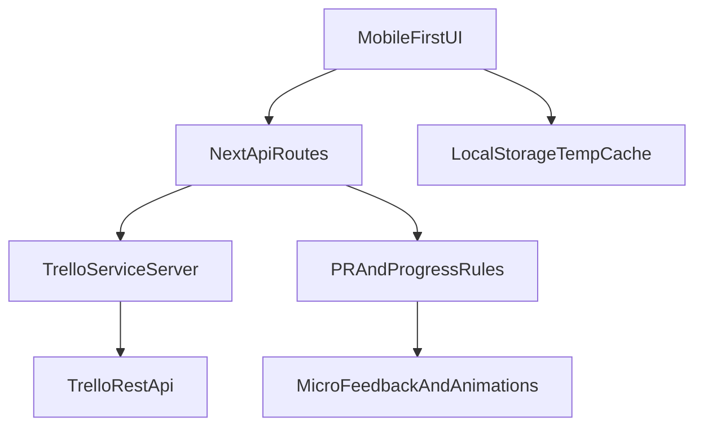

# Plano de refatoracao completa para Next + Trello

## Escopo fechado desta entrega

- Reescrita total do projeto no mesmo repositório para arquitetura Next.js App Router.
- Foco funcional exclusivo em progressão de carga por exercício (sem metas/histórico amplo legado).
- Integração real com Trello em todas as operações, com cache local apenas temporário.
- Entrega única com dashboard simples, microgamificação, PWA instalável e deploy Vercel-ready.

## Diagnóstico atual e impactos

- Stack atual usa Vite + React Router (`[C:\Users\visual\Desktop\Treino Verificado\package.json](C:\Users\visual\Desktop\Treino Verificado\package.json)`); será substituída por Next App Router.
- Integração Trello atual roda no cliente e expõe credenciais (`[C:\Users\visual\Desktop\Treino Verificado\src\services\trelloService.ts](C:\Users\visual\Desktop\Treino Verificado\src\services\trelloService.ts)`).
- Trecho crítico existente a ser eliminado na migração:

```6:18:C:\Users\visual\Desktop\Treino Verificado\src\services\trelloService.ts
function getAuthParams(): URLSearchParams {
  const key = import.meta.env.VITE_TRELLO_KEY
  const token = import.meta.env.VITE_TRELLO_TOKEN
  ...
}
...
const url = `${BASE_URL}${path}?${params}`
```

## Arquitetura alvo

- **Frontend:** Next.js App Router (`app/`) + TypeScript + Tailwind + Framer Motion + Recharts.
- **Backend interno:** rotas API Next (`app/api/...`) como proxy único para Trello.
- **Serviço Trello server-side:** `[C:\Users\visual\Desktop\Treino Verificado\services\trello.ts](C:\Users\visual\Desktop\Treino Verificado\services\trello.ts)` com as funções obrigatórias.
- **Cache cliente:** LocalStorage para resposta rápida/offline curto, com invalidação por timestamp.
- **PWA:** manifest + service worker para instalação no celular.




## Implementacao por etapas

### 1) Rebase do projeto para Next.js

- Substituir base Vite por estrutura Next App Router (`app/layout.tsx`, `app/page.tsx`, `app/globals.css`, `next.config.*`).
- Atualizar scripts de build/dev/start para Next e manter TypeScript estrito.
- Preservar Tailwind, adicionar Framer Motion e manter Recharts.

### 2) Modelo de dominio enxuto

- Definir tipos focados em progressão: `ExerciseProgress`, `WorkoutEntry`, `PRSnapshot`, `WeeklyStats`.
- Padronizar parser/formatter da descrição markdown do card de exercício com seções:
  - Ultimo Treino
  - Melhor Marca (PR)
  - Historico Resumido (ultimos 5)

### 3) Camada Trello server-side obrigatoria

- Implementar em `[C:\Users\visual\Desktop\Treino Verificado\services\trello.ts](C:\Users\visual\Desktop\Treino Verificado\services\trello.ts)`:
  - `getOrCreateBoard()`
  - `getOrCreateList()`
  - `createExerciseCard()`
  - `updateExerciseCard()`
  - `createWorkoutEntry()`
  - `checkAndUpdatePR()`
- Garantir bootstrap automático do board e listas obrigatórias na primeira carga.
- Padronizar chamadas Trello com tratamento de erro, retry leve e tipagem forte.

### 4) API interna do Next para segurança

- Criar rotas em `app/api` para encapsular fluxos:
  - inicialização do board/listas
  - listagem de exercícios
  - registro de treino
  - leitura de métricas de dashboard
- Ler `TRELLO_API_KEY` e `TRELLO_TOKEN` apenas no servidor.
- Bloquear qualquer exposição de token no cliente.

### 5) Fluxo principal de treino (2 cliques)

- Tela principal mobile-first: selecionar exercício -> registrar carga/reps -> salvar.
- Ao salvar:
  - atualizar descrição do card de exercício
  - criar card na lista de treinos
  - validar PR (maior carga ou mesma carga com mais reps)
  - se PR: atualizar seção PR e mover card para lista de PRs

### 6) Gamificacao elegante e discreta

- Barra animada de progresso vs PR.
- Badge animada de novo recorde.
- Feedback textual de incremento (ex.: +2.5kg).
- Contador de streak semanal.
- Confete discreto apenas em PR.
- Vibração em mobile via `navigator.vibrate` com fallback silencioso.

### 7) Dashboard simples

- Exibir: treinos da semana, ultimo PR, exercicio mais evoluido.
- Gráfico simples de evolução de carga (Recharts) por exercício ativo.
- Carregamento rápido com cache local e revalidação via API.

### 8) PWA e deploy

- Configurar manifest, ícones, estratégia de cache e instalabilidade.
- Garantir comportamento em modo escuro e layout touch-friendly.
- Preparar para Vercel: variáveis de ambiente, build de produção e checklist de publicação.

### 9) Validacao final

- Testar cenários reais contra Trello (sem mocks):
  - bootstrap de board/listas
  - criação/atualização de cards
  - detecção e promoção de PR
  - persistência após reload
- Testar instalação PWA em mobile e desktop.
- Revisar erros de lint e consistência de UX.

## Riscos e mitigacoes

- Migração grande de arquitetura (Vite -> Next): mitigar com corte total do legado e estrutura limpa inicial.
- Limites/latência do Trello API: mitigar com cache temporário local e mensagens de estado claras.
- Consistência da descrição markdown: mitigar com parser único e testes unitários do formatter.
- Segurança de credenciais: mitigar removendo acesso direto do frontend ao Trello.

